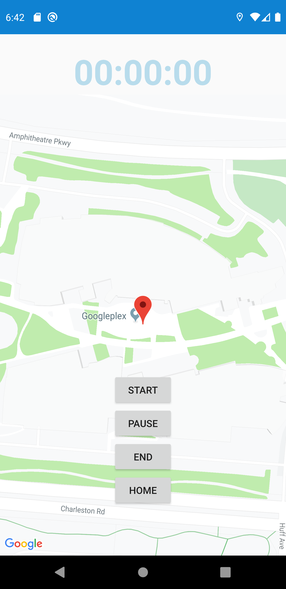

# RunningDiary
 a Running Diary mobile app has  features as the following:
 

1. Pace calculator

• Allow user to input distance and time to calculate pace and speed

2. Running GPS tracker with maps and routes/direction

• Capture the distance per run via GPS coordinates or device location

• Capture the time taken for each run from start to finish

3. Running log: save and display a history of runs including weekly averages

• Capture historical run statistics e.g. distance, time, pace, speed

• Calculate and display weekly averages based on historical run statistics

4. Music player access

• Allow user to choose, play and stop songs that are stored locally
